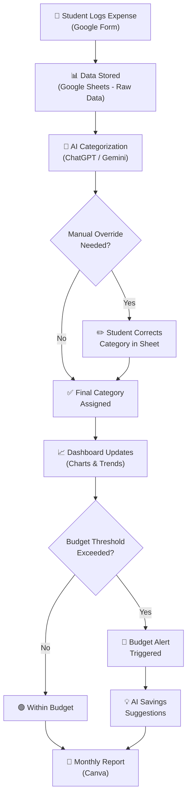
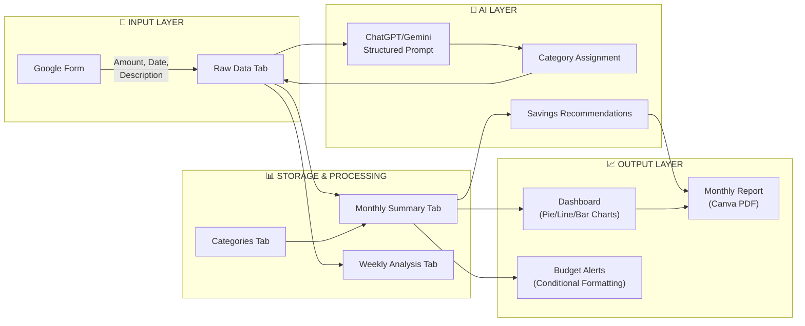
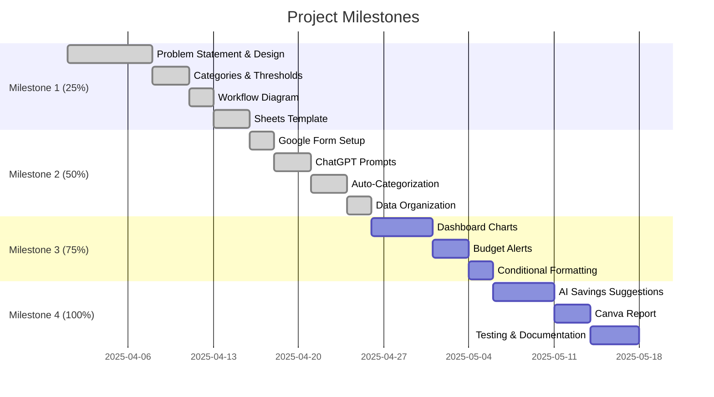

# System Workflow Diagram

## AI Personal Finance Tracker & Advisor

---

## High-Level Workflow



---

## Detailed Data Flow



---

## Step-by-Step Process

### Step 1: Expense Input
```
Student opens Google Form → Enters:
  • Amount: ₹250
  • Date: 2025-04-12
  • Description: "Zomato lunch"
  • Category Override: (optional, left blank)
```

### Step 2: Data Storage
```
Google Form auto-submits to Google Sheets:
  → Row added to "Raw Data" tab
  → Timestamp auto-generated
  → Category (Auto) column is empty (pending AI)
```

### Step 3: AI Categorization
```
Copy expense descriptions → Paste into ChatGPT/Gemini
  → Use structured prompt from docs/chatgpt_prompts.md
  → AI returns: "Food — Delivery"
  → Paste category back into Sheet
```

### Step 4: Pattern Analysis
```
Google Sheets formulas auto-calculate:
  → Total monthly spending
  → Category-wise percentages
  → Weekly comparisons
  → Budget alerts (conditional formatting)
```

### Step 5: Dashboard & Reporting
```
Charts auto-update:
  → Pie chart: category distribution
  → Line chart: monthly trend
  → Bar chart: week-over-week comparison
  
Monthly → Create Canva report with insights
```

---

## Milestone Progression Map


